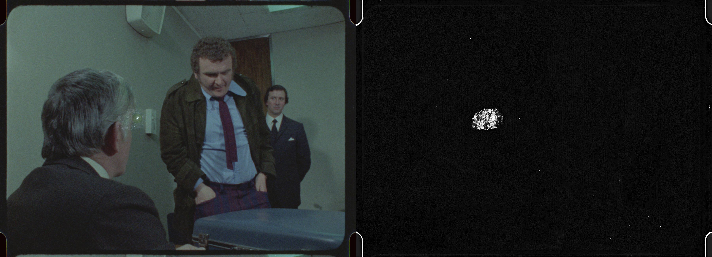
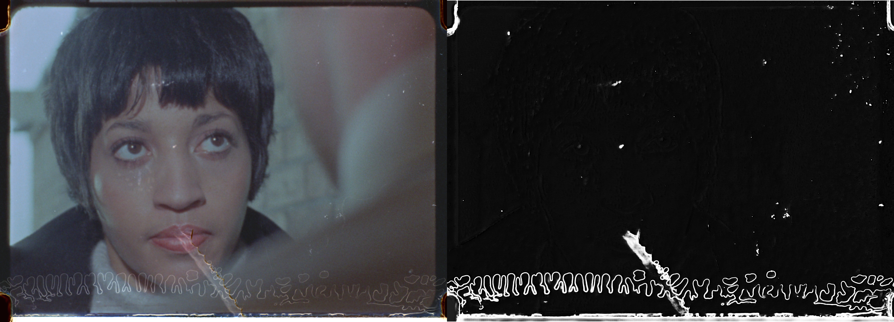

# Dataset
`/storage/datasets/dustdataset`

`256.8bit` - 8bit images with ground truth dust + masks
`256.clean` - 8bit image with ground truth no dust

# Film dust and scratch prediction




Based on modified PyTorch implementation of [U-Net: Convolutional Networks for Biomedical Image Segmentation](https://arxiv.org/abs/1505.04597) (Ronneberger et al., 2015).

# Inference

```bash

python3 infer.py path/to/img.png

```

# Train

`python3 train.py`